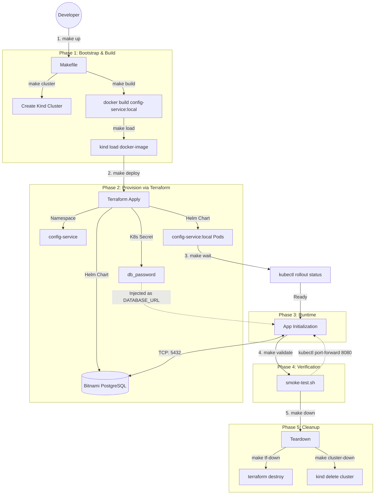
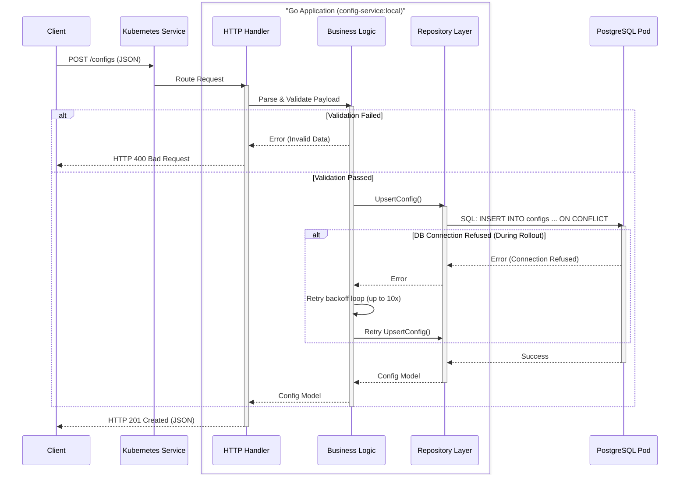

# config-service

A config management HTTP API (Go + PostgreSQL) deployed to local Kubernetes via Kind, Helm, and Terraform.

## Prerequisites

| Tool | Version |
|------|---------|
| Go | ≥ 1.22 |
| Docker | ≥ 24 |
| Kind | ≥ 0.22 |
| kubectl | ≥ 1.29 |
| Helm | ≥ 3.14 |
| Terraform | ≥ 1.8 |

## Quick Start

```bash
# 1. Supply the Postgres password via environment variable (preferred — nothing written to disk)
export TF_VAR_db_password="your-local-password"

# Alternative: copy the example tfvars file and edit it (also gitignored)
# cp infra/terraform/terraform.tfvars.example infra/terraform/terraform.tfvars

# 2. Stand up everything
make up

# 3. Run smoke tests against the live deployment
make validate
```

Tear down:

```bash
make down
```

## Makefile Targets

| Target | Description |
|--------|-------------|
| `make up` | Cluster → build → load → deploy → wait (full bootstrap) |
| `make down` | Destroy app, infra, cluster |
| `make cluster` | Create Kind cluster (idempotent) |
| `make build` | Build `config-service:local` Docker image |
| `make load` | Load image into Kind (no registry needed) |
| `make deploy` | `terraform apply` — provisions Postgres + deploys app |
| `make wait` | Wait for deployment rollout |
| `make validate` | End-to-end smoke tests via port-forward |
| `make test` | Go unit tests with race detector |
| `make lint` | gofmt + go vet |
| `make tf-validate` | terraform fmt check + validate |
| `make helm-lint` | Helm chart lint |

## API

| Method | Path | Behaviour |
|--------|------|-----------|
| `GET` | `/ping` | Returns `pong` — liveness check |
| `GET` | `/configs/:id` | Returns config or `404` |
| `POST` | `/configs` | Upsert (create or overwrite) |

**Upsert request body:**

```json
{
  "id": "cfg_1",
  "host": "db.internal",
  "port": 5432,
  "app_name": "my-service",
  "log_level": "INFO"
}
```

`log_level` must be one of: `TRACE`, `DEBUG`, `INFO`, `WARN`, `ERROR`, `FATAL`.  
`port` must be 1–65535. All fields are required. Returns the saved record on success.

## Infrastructure Design

This project follows a strict, idempotent orchestration pipeline to guarantee local reproducibility. 

### 1. End-to-End Orchestration (Flowchart)



### 2. Request Lifecycle (Sequence Diagram)

The Go application utilizes a clean, layered architecture ensuring validation occurs before persistence, and robust retry loops handle database unavailability during Kubernetes rollouts.



- **Kind** — single-node local cluster, no extra daemon, fast teardown.
- **Terraform** — single source of truth. One `terraform apply` provisions the namespace, Bitnami Postgres (Helm), and the app (Helm). One `terraform destroy` cleans up everything.
- **Helm chart** (`helm/config-service`) — creates a Deployment, Service, ConfigMap, and Secret. Enforces strict `securityContext` (non-root, read-only filesystem, dropped capabilities).
- **Access** — `kubectl port-forward` for local testing. No ingress needed.
- **Image** — multi-stage Dockerfile, distroless runtime image. Loaded into Kind via `make load`, so `imagePullPolicy: Never`.

## Configuration & Secrets

- Non-sensitive config (`APP_PORT`, `LOG_LEVEL`) → Kubernetes `ConfigMap`

### Database Credentials

`DATABASE_URL` is stored in a Kubernetes `Secret` and injected as an environment variable. The password is supplied to Terraform at deploy time — two supported approaches:

**Preferred — environment variable (nothing written to disk):**
```bash
export TF_VAR_db_password="your-local-password"
make deploy
```

**Alternative — `terraform.tfvars` (gitignored, never committed):**
```bash
cp infra/terraform/terraform.tfvars.example infra/terraform/terraform.tfvars
# set db_password = "your-local-password"
```

Terraform's `db_password` variable is marked `sensitive = true`, so it is redacted from plan/apply output. Helm `set_sensitive` blocks are used for the password and DSN so they are also redacted.

### Production Considerations

In production, `db_password` would come from a secrets manager (Vault, AWS Secrets Manager) via a Terraform data source — the application code and Kubernetes Secret structure would not change, only the Terraform source of the value.

## Database

Schema is applied at startup via an embedded `CREATE TABLE IF NOT EXISTS` — idempotent:

```sql
CREATE TABLE IF NOT EXISTS configs (
    id         TEXT        PRIMARY KEY,
    host       TEXT        NOT NULL,
    port       INTEGER     NOT NULL CHECK (port > 0 AND port <= 65535),
    app_name   TEXT        NOT NULL,
    log_level  TEXT        NOT NULL DEFAULT 'INFO',
    updated_at TIMESTAMPTZ NOT NULL DEFAULT now()
);
```

`id` is a user-supplied string (no auto-increment). The `CHECK` constraint on `port` is defense-in-depth alongside application validation.

## Operational Readiness

- **Health checks** — `/ping` is used for both liveness and readiness probes. The HTTP server starts only after migrations succeed, so readiness also implies the database is reachable.
- **DB retry** — on startup, the app retries the Postgres connection up to 10 times (3 s delay) before exiting. Kubernetes restarts the pod, backing off naturally.
- **Graceful shutdown** — SIGTERM triggers a 15 s shutdown window.
- **Logs** — structured JSON via `log/slog`. Startup failures (DB unavailable, missing env var) are surfaced immediately.

## Troubleshooting

```bash
# Pod status
kubectl get pods -n config-service
kubectl logs -n config-service -l app=config-service -f

# Postgres
kubectl get pods -n config-service -l app.kubernetes.io/name=postgresql
kubectl logs -n config-service -l app.kubernetes.io/name=postgresql

# Helm releases
helm list -n config-service

# Pod in CrashLoopBackOff — check previous logs
kubectl logs -n config-service -l app=config-service --previous
# If you see "database not ready, retrying" x10, wait for Postgres then:
kubectl rollout restart deployment/config-service -n config-service
```

## Known Limitations

- Single replica, no HA Postgres — fine for local dev.
- No TLS between app and Postgres (`sslmode=disable`).
- Port-forward for access — no ingress controller.
- Bitnami Helm chart v16.3.0 pins `postgresql:17.2.0-debian-12-r2` which was removed from Docker Hub. The `image.tag` is overridden to `latest` in `infra/terraform/main.tf` and pre-loaded into Kind.
- Migrations run in-process. A dedicated tool (`golang-migrate`) would be used if the schema grows.
